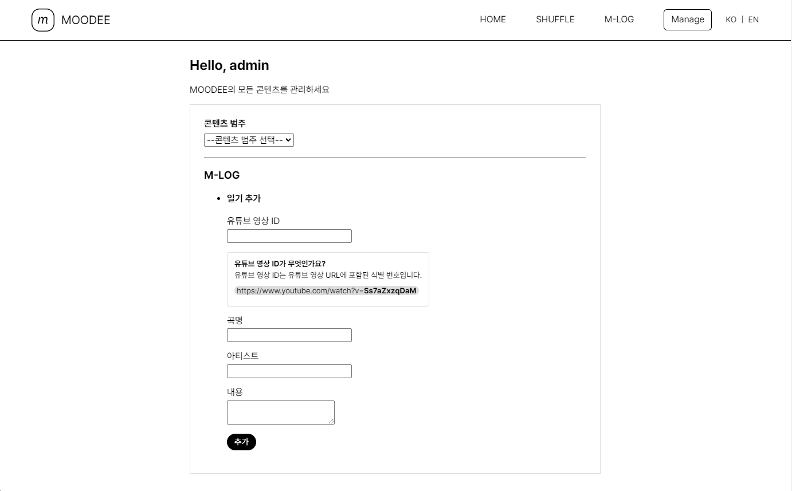

# MOODEE

MOODEE는 [YouTube Player API]("https://developers.google.com/youtube/iframe_api_reference?hl=ko")를 이용한 플레이리스트 재생기입니다.

## 개발 환경

MOODEE의 개발 환경은 다음과 같습니다.

- Tomcat 9.0.68
- MySQL 8.0.30
- JDK 17.0.5

## 호스팅

Tomcat을 이용하여 8080 포트에서 MOODEE를 호스팅합니다.

### tomcat-users.xml

`/Tomcat_hosting_reference`에 위치한 `tomcat-users.xml`을 Tomcat 설정에 사용합니다.

### MySQL과의 연동

MySQL을 설치하고 다음 파라미터를 참고하여 데이터베이스를 생성하세요.

| 속성              | 값                                   |
| ----------------- | ------------------------------------ |
| 데이터베이스 이름 | MoodeeDB                             |
| url               | jdbc:mysql://localhost:3306/MoodeeDB |
| user              | root                                 |
| password          | 1234                                 |

데이터베이스 생성이 완료되면 `/src/main/webapp/SQLs/createTables.sql`을 실행하여 테이블을 생성하세요. 그 뒤에 미리 정의된 플레이리스트를 추가하기 위해 `/src/main/webapp/SQLs/insertItems.sql`을 실행하세요.

## 기능

### 플레이리스트 추천

MOODEE에 첫 화면으로 추천 플레이리스트가 나타납니다. `이전`, `다음` 버튼을 눌러 어떤 플레이리스트가 있는지 살펴보세요. 마음에 드는 플레이리스트가 있다면 `PLAY`를 눌러 바로 재생하세요.

### 플레이리스트 재생 (SHUFFLE)

원하는 플레이리스트를 선택하여 감상하세요. 플레이리스트 선택 후 `플레이리스트 재생 준비 완료` 토스트 메세지가 출력되면 재생 버튼을 클릭하여 음악을 감상할 수 있습니다.

음악 재생 중 곡의 제목을 클릭하면 YouTube에서 직접 감상할 수 있습니다.

### 한 줄 일기 (M-LOG)

작성한 한 줄 일기를 확인할 수 있습니다. 한 줄 일기의 작성은 후술한 관리(Manage) 페이지에서 수행할 수 있습니다. 커버 이미지를 클릭하면 해당 음악의 YouTube 링크로 이동합니다.

### 관리 (Manage)

관리(Manage) 페이지 접근 시 시큐리티 처리에 의해 사용자 인증을 요구 받습니다. 기본 사용자 이름과 암호는 `admin`, `admin1234`입니다. 관리 가능한 항목은 다음과 같습니다.

| 콘텐츠 범주 | 변경 대상                  |
| ----------- | -------------------------- |
| GENERAL     | 로고 변경                  |
| SHUFFLE     | 플레이리스트 추가, 곡 추가 |
| M-LOG       | 일기 추가                  |

### 다국어 지원

데스크탑에서 우측 상단, 모바일에서 내비게이션 바 오픈 시 나타나는 `ko | EN` 선택 박스를 통해 언어를 변경할 수 있습니다.

### 반응형 웹 지원

반응형 웹을 지원하여 모바일 환경에서도 불편없이 사용 가능합니다.

## Reference

- [toastify-js]("https://github.com/apvarun/toastify-js")
- [particles.js]("https://github.com/marcbruederlin/particles.js")
